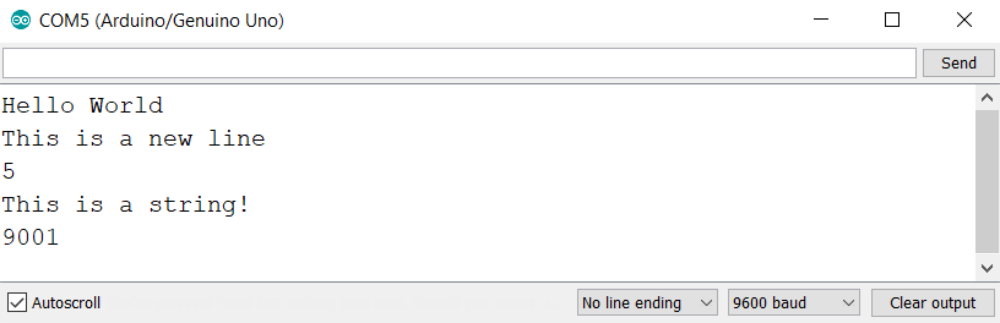

#Serial Monitor

The serial monitor is a window that allows you communicate with your Arduino. It is located in the bottom right hand corner of the editor. You can receive information from your Arduino such as if a button was pressed or what value is being received on an analog pin. 

<center></center>

The serial monitor in the UNO editor MUST be used with a delay of 100ms or more in the loop() when repeatedly printing to the serial monitor. This may be accomplished by other processes being computed in the code, or by use of a delay() function. If there is no delay, the editor can enter a continuous loop, unable to process any other commands. This can crash your browser and force you to restart.

##Object

The serial monitor is interacted with using the pre-defind **Serial** object. The object contains all the methods that can be used to print and read from the serial monitor. 

The Arduino can be hooked up to several different output devices including LCD screens and touch screens. Because you can print to each of these, a general 'print' function won't work because you wouldn't know what you're printing to. Instead, each of these devices can have an object with an associated 'print' method. For the serial monitor, it looks like this.

```c++
//Object.method(argument);
Serial.print("Hello World");
```

##Methods

###Serial.begin(BAUD)

* **BAUD** - the BAUD rate is the speed at which the Arduino and serial monitor communicate with eachother.

The begin() method has to be called before any other method. It is usually used within the setup.

###Serial.print(var)

* **var** - any data type. Numbers, characters, strings, and variables can be entered into the print method.

The print method will print the argument entered. It does not skip a line after printing.

###Serial.println(var)

* **var** - any data type. Numbers, characters, strings, and variables can be entered into the print method.

The println method will print the argument entered, and then skips to the next line.

##Examples

```c++
int myInt = 5;
String myString = "This is a string!";

void setup() {
  Serial.begin(9600);
  Serial.print("Hello");    //Print 'Hello' and don't skip a line
  Serial.println(" World"); //Print 'World' with a space in front of it on the same line as 'Hello'. ln skips to the  next line
  Serial.println("This is a new line"); //This line is printed on the next line
  Serial.println(myInt);    //Printing variables doesn't require quotes
  Serial.println(myString); //Printing string variables also doesn't require quotes.
  Serial.println(9001);     
}

void loop() {
}
```



####Credits

For more information see the [Arduino reference page for the serial monitor](https://www.arduino.cc/reference/en/language/functions/communication/serial/)